# Smash Ultimatum

## Overview:
Smash Ultimatum is an application that allows users to create and join Super Smash Bros. Ultimate Iron Man Arenas as well as Tournaments.  Every match that a user participates in the results are saved under that users account.  This was primarily accomplished using React, Javascript, Express, and Mongo.

### Table of Contents:
1. [How it works](#How-it-works)
2. [Example](#Example)
3. [Contributing](#Contributing)
4. [Questions](#Questions)
5. [License](#License)

### How it works!
Once a user visits the App the User will need to login via their Google account.  After logging in the user will be redirected to the Main Dashboard of the app.  Here a user can decide to either create or join an Iron Man Arena or Tournament.  To Join either a Tournament or an Iron Man all you need is Tournament or Arena Lobby Code.  Users can also access Their own accouts Stats. as well as their records with each individual character.  There are also Both Iron Man and Tournament Leaderboards to check out how you stand vs all other users.  

Login With A Google Account   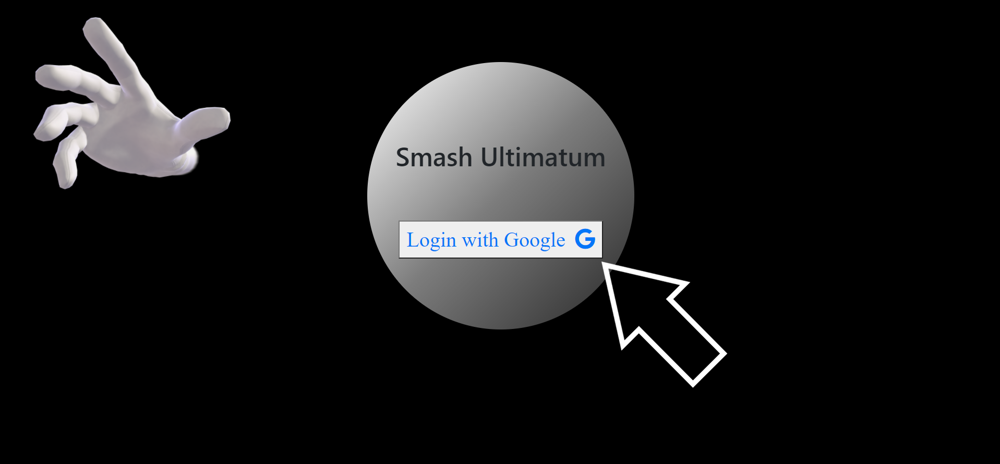   Create An Iron Man Arena   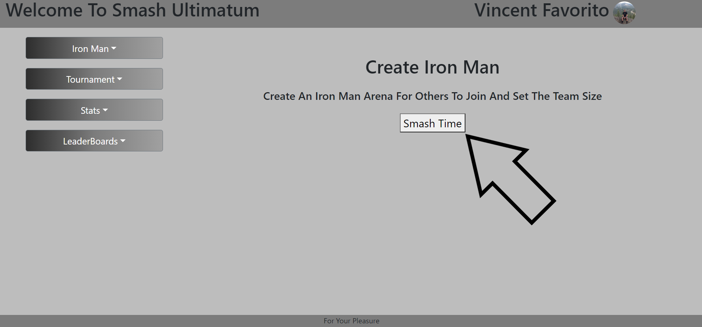   Select Team Size   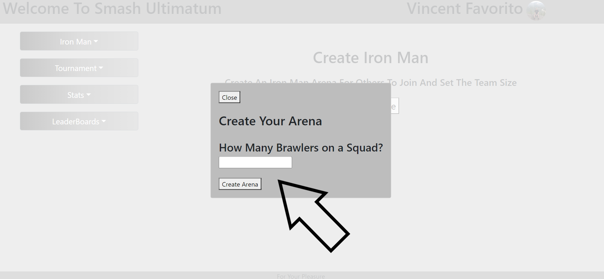   Join An Iron Man Arena   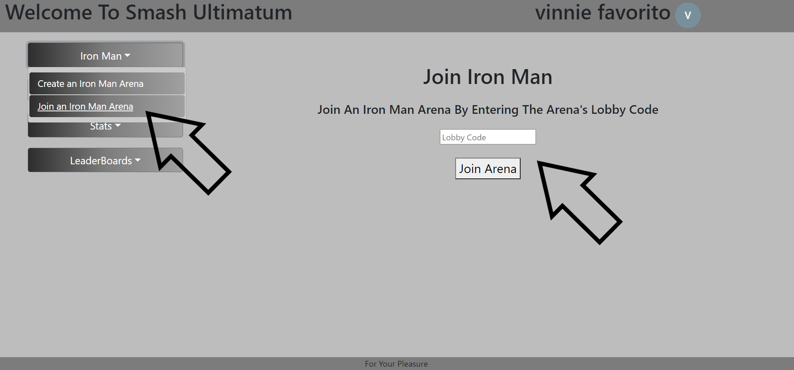   When At Least Two Users Have Entered An Arena Random Teams Of Characters Are Generated For Each User  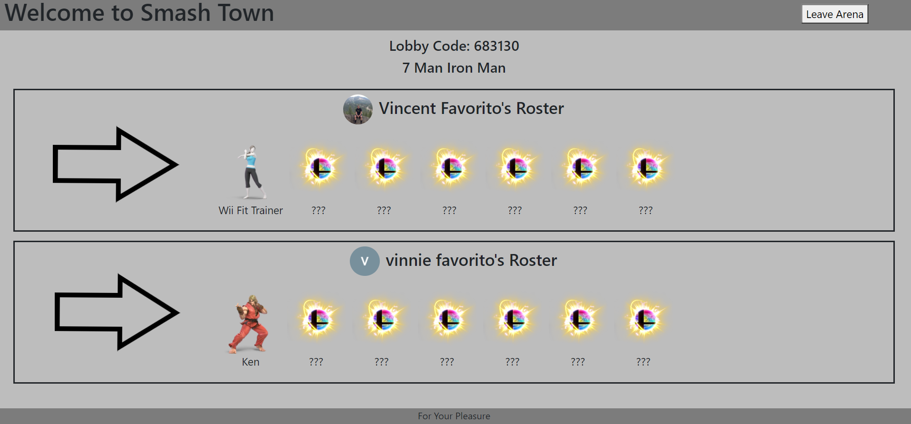   After Playing The Match The Creater Of the Arena Can Select Who Was Victorious   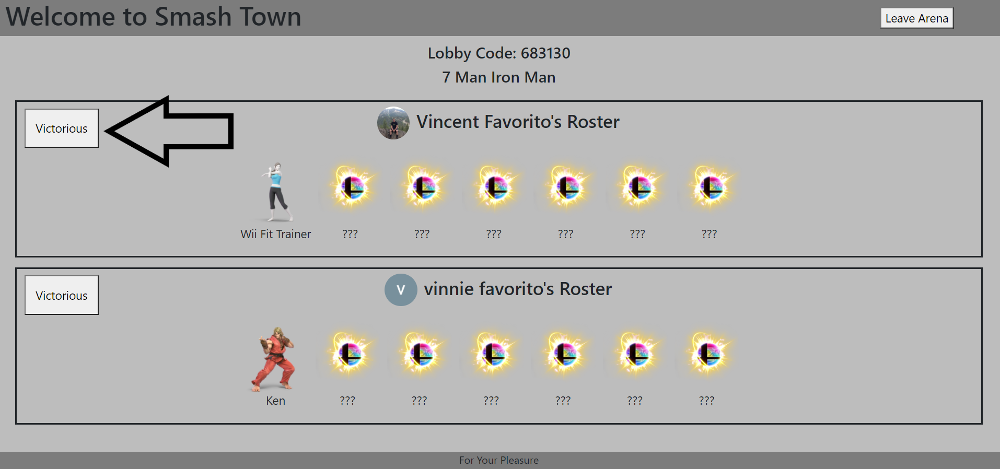   After Selectiong Who Was Victorious All Other Users In The Arena Can Vote If That User Was Indeed Victorious   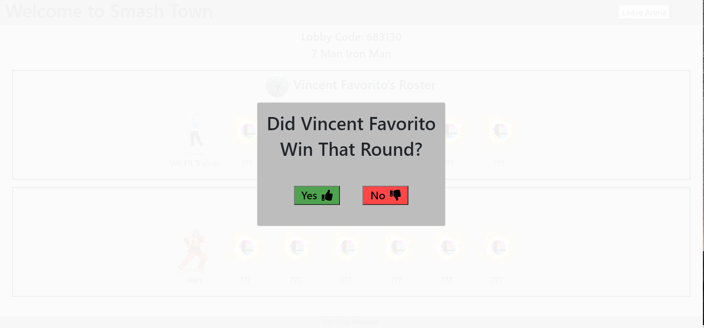   If The Vote Was A Unanimous Yes That User Gets To Move On To Their Next Character Which Will Be Revealed.   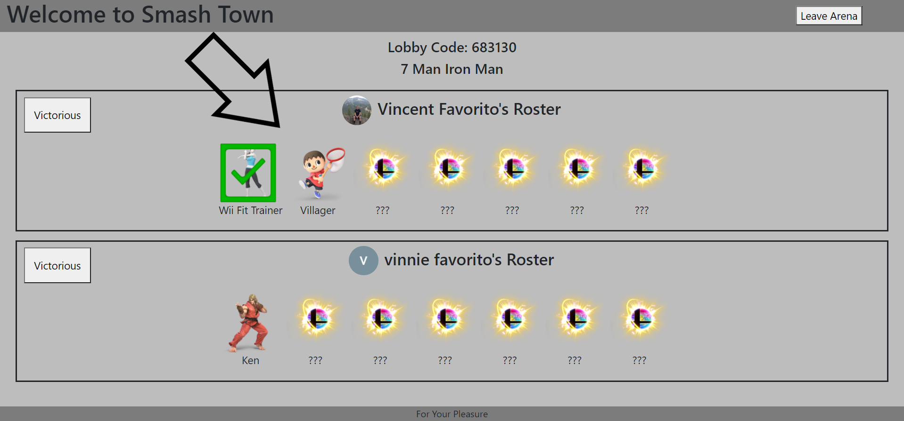   First User To Win A Match With All Of Their Characters Will Be Crowned The Smash King.   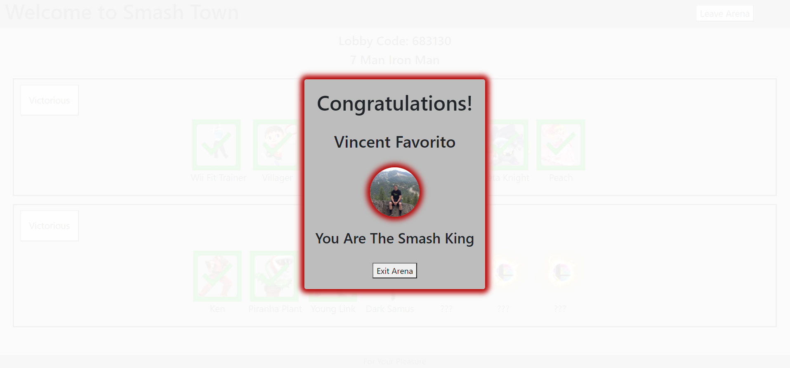   Create A Tournament.   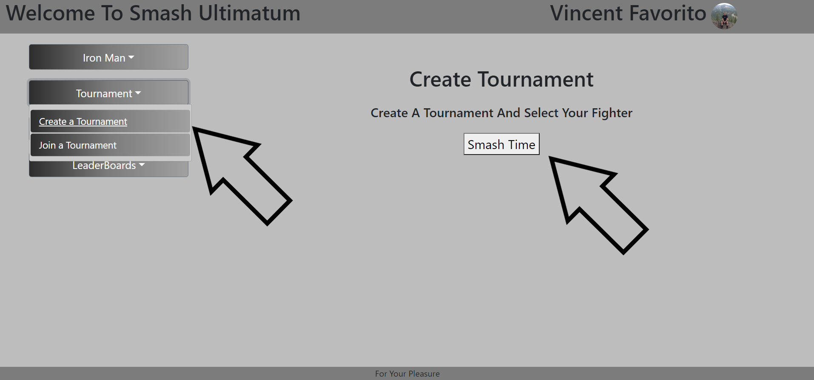   Enter Tournament Settings   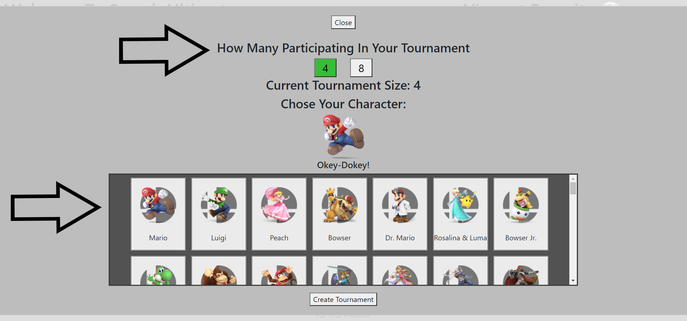   Redirected To Tournament Load Page   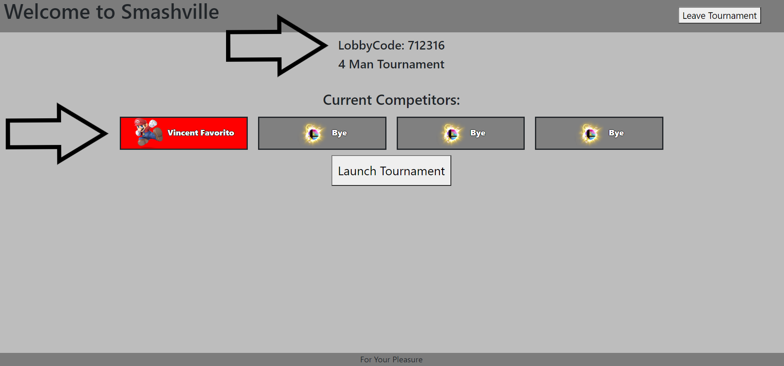   Join A tournament   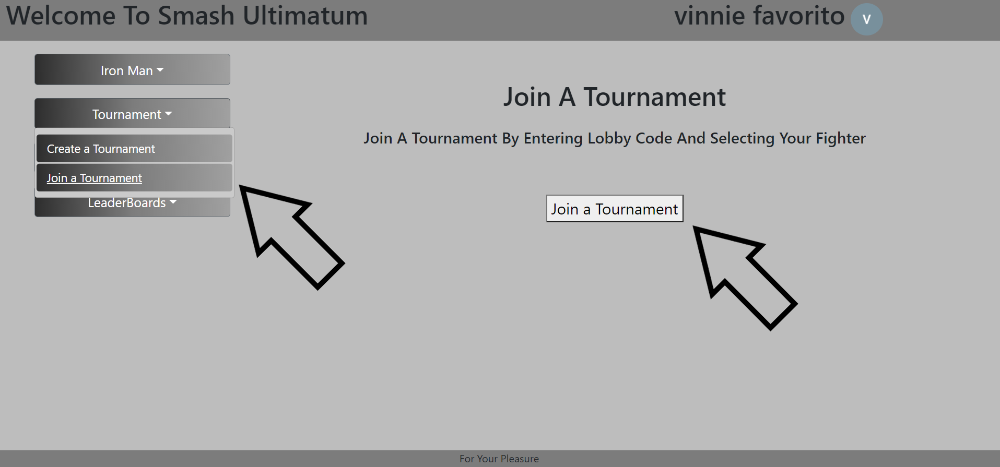   Launch Tournament Once All Users Have Joined.   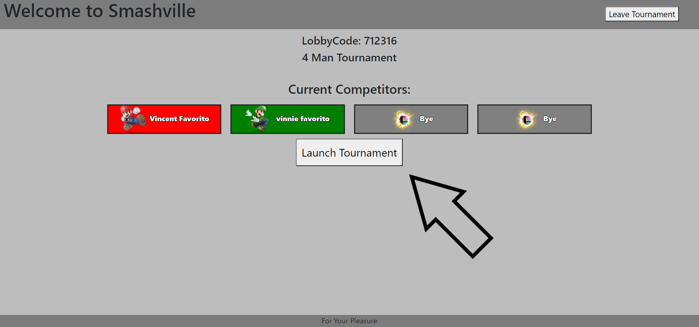   Creater Of The Tournament Selects The Winner Of Each Match To Move Them Forward.      Win The Final To Be Crowned The Smash King.   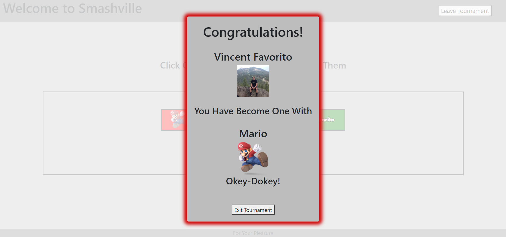   Check Your Account Record   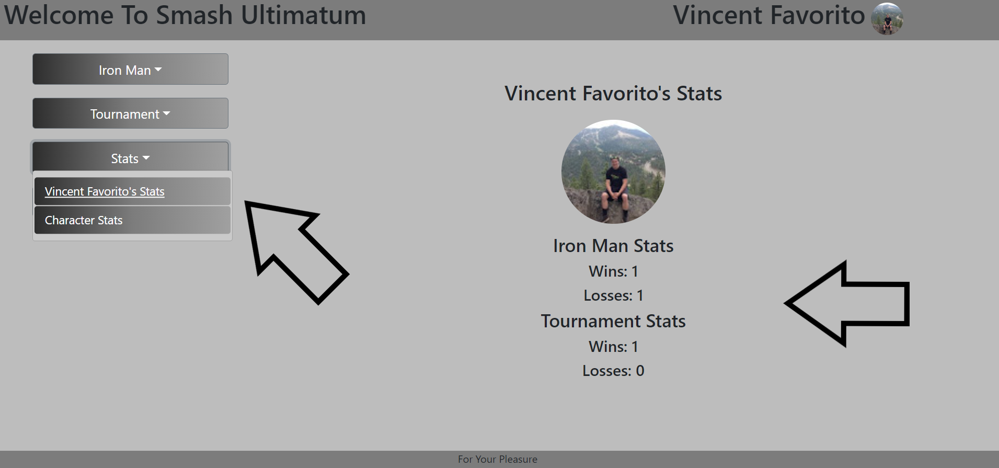   Check Your Account's Character Records.   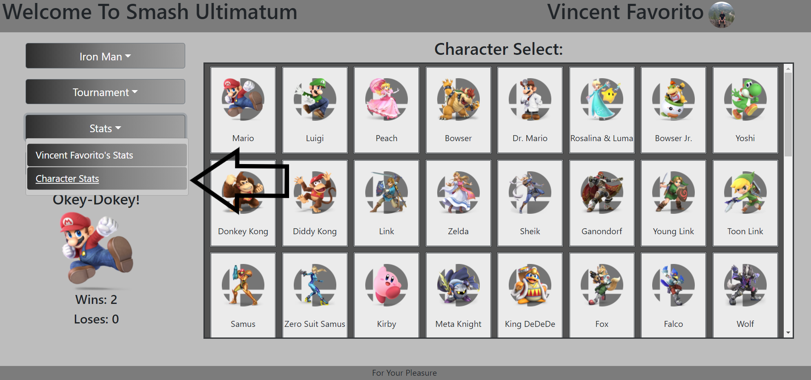   Checkout The LeaderBoards   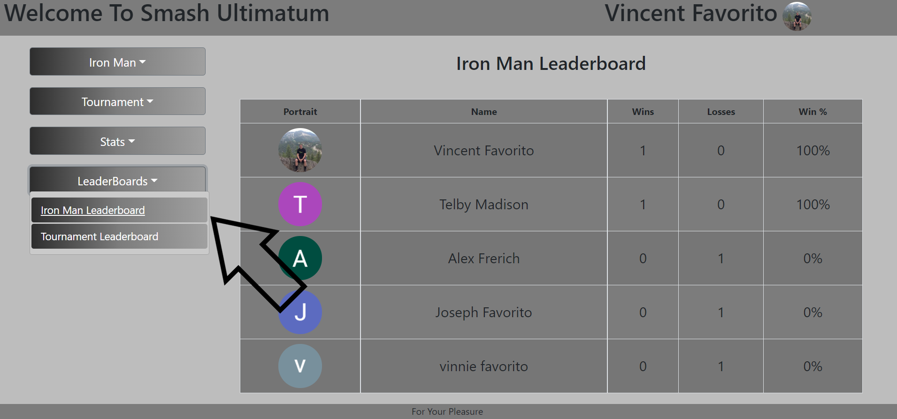   

### Example
Here is a link to Smash Ultimatum:  [https://smash-ultimatum.herokuapp.com](https://smash-ultimatum.herokuapp.com)

### Contributing
If you would like to contribute to the development of this app the guidelines for doing so can be found here: [Contribution Covenant](https://www.contributor-covenant.org/version/2/0/code_of_conduct/code_of_conduct.txt)

### Questions?
Visit my Github profile here: [vfavorito](https://github.com/vfavorito) 
If you have any questions you can reach out to me at vince.favorito@gmail.com

### License
This App is covered under the MIT License