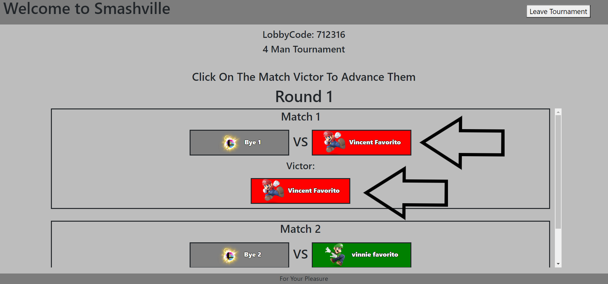

# Smash Ultimatum

## Overview:
Smash Ultimatum is an application that allows users to create and join Super Smash Bros. Ultimate Iron Man Arenas as well as Tournaments.  Every match that a user participates in the results are saved under that users account.  This was primarily accomplished using React, Javascript, Express, and Mongo.

### Table of Contents:
1. [How it works](#How-it-works)
2. [Iron man arenas](#Iron-Man-Arenas)
3. [Tournaments](#Tournaments)
4. [Stats](#Stats)
5. [Example](#Example)
6. [Contributing](#Contributing)
7. [Questions](#Questions)
8. [License](#License)

### How it works!
Once a user visits the app the user will need to login via their Google account.  After logging in the user will be redirected to the Main Dashboard of the app.  Here a user can decide to either create or join an Iron Man Arena or Tournament.  They can also view their account stats.  To Join either a Tournament or an Iron Man all you need is the Tournament or Arena Lobby Code.  There are also both Iron Man and Tournament Leaderboards to check out how you stand against all other users.  

 

### Login With A Google Account 
  

 

## Iron Man Arenas
 

### Create An Iron Man Arena 
 

 

### Select Team Size 
 

 

### After Creating An Arena It Will Redirect You To The Arena Page And Will Launch After At Least One Other User Joins
 

 

### Join An Iron Man Arena By Entering Arena Lobby Code
  

 

### When At Least Two Users Have Entered An Arena Random Teams Of Characters Are Generated For Each User
  

 

### After Playing The Match The Creater Of the Arena Can Select Who Was Victorious
  

 
 

### After Selectiong Who Was Victorious All Other Users In The Arena Can Vote If That User Was Indeed Victorious
  

 

 

### If The Vote Was A Unanimous Yes That User Gets To Move On To Their Next Character Which Will Be Revealed
 

 

 

### First User To Win A Match With All Of Their Characters Will Be Crowned The Smash King
  

 

 

## Tournaments
 

### Create A Tournament
  

 

 

### Enter Tournament Settings 
  

 

 

### After Entering Tournament Settings You Will Be Redirected To The Tournament Load Page 
  

 

 

### Join An Existing Tournament
  

 

 

### Enter Lobby Code And Select Your Character
  

 

 

### After Everyone Has Joined The Tournament You Can Launch It
  

 

 

### The Creater Of The Tournament Selects The Winner Of Each Match To Move Them Forward
  

 

 

### Win The Final To Be Crowned The Smash King
  

 

 

## Stats
 

### Check Your Account Record 
  

 

 

### Check Your Account's Character Records
  

 

 

### Checkout The LeaderBoards 
  

 

 

### Example
Here is a link to Smash Ultimatum:  [https://smash-ultimatum.herokuapp.com](https://smash-ultimatum.herokuapp.com)

### Contributing
If you would like to contribute to the development of this app the guidelines for doing so can be found here: [Contribution Covenant](https://www.contributor-covenant.org/version/2/0/code_of_conduct/code_of_conduct.txt)

### Questions?
Visit my Github profile here: [vfavorito](https://github.com/vfavorito) 
If you have any questions you can reach out to me at vince.favorito@gmail.com

### License
This App is covered under the MIT License